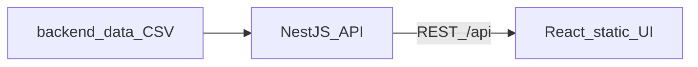

# Traffic Intelligence Framework, Demo

Demo Link: https://share.vidyard.com/watch/DYzXv8SScfez7zo6ffpthB

Live Application Hosted: (https://performance-intelligence-command-ce-alpha.vercel.app/)

*(Repository: [Performance-Intelligence-Command-Center](https://github.com/Xaaby/Performance-Intelligence-Command-Center))*


## Quick Start

```bash
git clone https://github.com/Xaaby/Performance-Intelligence-Command-Center.git
cd Performance-Intelligence-Command-Center
cp .env.example .env
cd backend/data
pip install -r requirements.txt
python3 generate_vendors.py
cd ../..
docker-compose up --build
```

For local UI development (`cd frontend && npm run dev`), ensure `.env` includes `VITE_PROXY_TARGET=http://localhost:3001` so `/api` requests reach the Nest server (the Vite dev server defaults the proxy to `http://backend:3001` for Docker-style hostnames).

Open [http://localhost:5173](http://localhost:5173).

The API is available at [http://localhost:3001](http://localhost:3001) (for example [http://localhost:3001/api/health](http://localhost:3001/api/health)). See [docs/API_CONTRACT.md](docs/API_CONTRACT.md) for routes.

## What You're Seeing

This demo is built for an automotive marketing team that buys third‑party web traffic and sends it to vehicle detail pages. After the click, the team cannot see landing‑page behavior or conversions—so “quality” has to be inferred from redirect‑layer signals alone.

The app is a live dashboard over **synthetic** vendor traffic: every row is scored for quality and fraud, ranked, and tied to budget recommendations (scale, hold, reduce, or emergency pause). You also get an interactive **simulator** to replay “what‑if” signal changes and an **experiments** view for cold start, A/B tests, and bandit‑style allocation—described in plain language for executives, with full formulas in the docs.

## Architecture

```
Synthetic CSV (backend/data/vendors.csv)
    → NestJS API :3001 (load, score, REST /api/*)
    → Browser calls API from React (Vite) static UI :5173
```



## Scoring Engine

Traffic **Quality** is a weighted blend of IP diversity, geo match, device‑fingerprint spread, click‑timing variance, and bot‑candidate rate. **Fraud probability** is a separate weighted blend (velocity bursts, IP concentration, scanner hints, fingerprint clustering, behavioral regularity). The **effective score** combines them so high fraud drags down an otherwise “clean looking” vendor—matching the story in the demo script.

Those scores drive tiers, fraud status, and **budget actions** (for example scale +20% or emergency pause). For variable definitions, thresholds, and full formulas, see [docs/SCORING_ENGINE.md](docs/SCORING_ENGINE.md).

## Project layout

| Path | Purpose |
|------|---------|
| `backend/` | NestJS API |
| `frontend/` | React + Vite UI |
| `docs/` | API, data schema, scoring reference, demo script |

## Demo narrative

Step‑by‑step talking points: [docs/DEMO_SCRIPT.md](docs/DEMO_SCRIPT.md).
